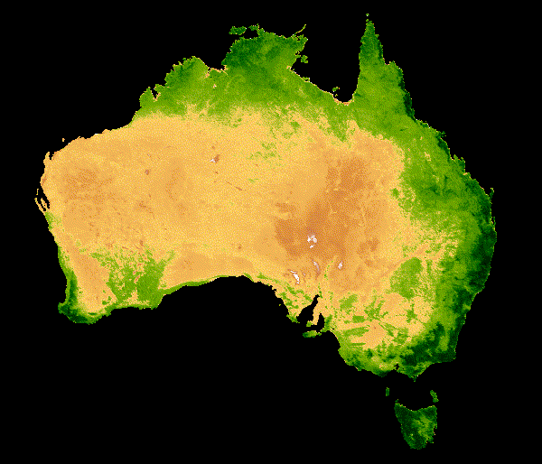

# First Visualization and Analysis in GEE
This assignment uses Google Earth Engine (GEE) to construct NDVI in Australia across 20-year median NDVI for serial 16-day MODIS composites spanning January 1st through December 31st after following the instruction posted by GEE. Students should upload and paste the resulting image and the code that generate this image to the GitHub repository. The animated NDVI image pasted below is sourced from MODIS, and NDVI is a standard reflectance-based vegetation index. NDVI below is represented by a color gradient ranging from tan to dark green, corresponding to low to high photosynthetic capacity. I chose Australia as my interested country for this assignment, and I found some interesting observations. 1) In some central Australian continent areas, the NDVI keeps at a low-value range no matter the season. In contrast, most of the coastal regions have high NDVI values. Coastal areas with high NDVI values received more precipitation brought by the sea wind. 2) The NDVI value has a distinct migrating pattern that areas with low-value move mostly north and south. 

> 

